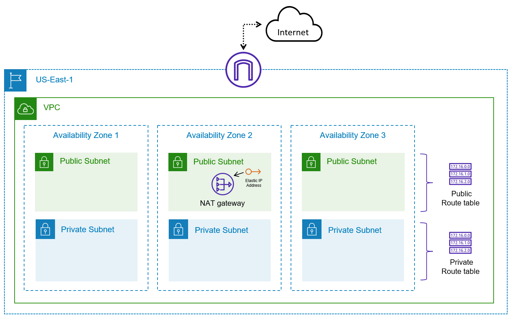

# Lab: Benefits of IaC

## Benefits of IaC

While there are many benefits of Infrastructure as Code, a few key benefits include the simplification of cloud adoption, allowing us to quickly adopt cloud-based services and offerings to improve our capabilities. Infrastructure as Code allows us to remove many of the manual steps required today for infrastructure requests, giving us the ability to automate approved requests without worrying about tickets sitting in a queue. We can also use Infrastructure as Code to provide capacity on-demand by offering a library of services for our developers, even publishing a self-service capability where developers and application owners can be empowered to request and provision infrastructure that better matches their requirements. Again, all of this is possible while driving standardization and consistency throughout the organization, which can drive efficiencies and reduce errors or deviations from established norms.

### Automated Testing
The code provided in this lab is tested on a weekly basis to work with the latest version of Terraform.

### References

[Infrastructure as Code in a Private or Public Cloud](https://www.hashicorp.com/blog/infrastructure-as-code-in-a-private-or-public-cloud)

# Lab Instructions

You have been tasked with deploying some basic infrastructure on AWS to host a proof of concept environment. The architecture needs to include both public and private subnets and span multiple Availability Zones to test failover and disaster recovery scenarios. You expect to host Internet-facing applications. Additionally, you have other applications that need to access the Internet to retrieve security and operating system updates.

- **Task 1:** Create a new VPC in your account in the US-East-1 region
- **Task 2:** Create public and private subnets in three different Availability Zones
- **Task 3:** Deploy an Internet Gateway and attach it to the VPC
- **Task 4:** Provision a NAT Gateway (a single instance will do) for outbound connectivity
- **Task 5:** Ensure that route tables are configured to properly route traffic based on the requirements
- **Task 6:** Delete the VPC resources
- **Task 7:** Prepare files and credentials for using Terraform to deploy cloud resources
- **Task 8:** Set credentials for Terraform deployment
- **Task 9:** Deploy the AWS infrastructure using Terraform
- **Task 10:** Delete the AWS resources using Terraform to clean up our AWS environment

The end state of the AWS environment should look similar to the following diagram:

> _This lab will walk you through configuring the infrastructure step by step using a manual process. After manually completing the tasks, the lab will show you how Terraform can be used to automate the creation of the same infrastructure._
